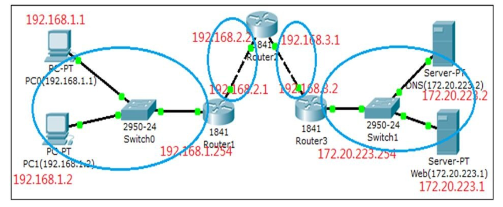

# Network Knowledge

## 1. Packet Tracer 是由 Cisco 发布的一个辅助学习工具
为学习思科网络课程的初学者去设计、配置、排除网络故障提供了网络模拟 环境。
用户可以在软件的图形用户界面上直接使用拖曳方法建立网络拓扑，并可提
供数据包在网络中行进的详细处理过程，观察网络实时运行情况。

## 2. Network Layer


## 3. Netowrk configuration

### a. MAC Address
### b. IP Address
### c. Subnet Mask
### d. Gateway
### e. DNS Server 

## 4. Network Devices

### a. Network Cable -- Connect two hosts

### b. Hub -- Connect three and more hosts
Why need hub? ==> 两根线连接(缠在一起)会造成电信号混乱    
hub(集线器)能够完成多个电脑的链接.

### c. Switch
Why need Switch?  ==> To replace Hub    
hub 会永远以广播的形式发包， 这样会导致网络拥堵.    
switch 会自己学习（第一次是广播）然后只向需要的地址发包.    


#### ping 192.168.1.2 的过程
```
1. --> ARP protocol packet （是一个广播）：获取一个主机上的网卡号，即 mac 地址
当对应主机收到 arp 信息后，回复自己的 mac 地址。
交换机把 ip 和其对应的 mac 地址写入 arp 表中。    
主机收到 arp 回复后也把对方 ip 和对应的 mac 地址写入自己的 arp 缓存中.

2.--> icmp protocol packet （点对点）
向 mac 地址直接发送点对点数据
```

### d. Router


+ 链接不同网络的设备叫做路由器.
+ subnet 之间不能通讯，需要一个中间人，这个中间人就是 router.
+ 一个 router 上有两个 network interfaces, 可以把特定的 ip 传递给另一个 network interface.
+ 不在同一网段的pc，需要设置默认网关才能把数据传送过去 通常情况下，都会把路由器默认网关.
+ 当路由器收到一个其它网段的数据包时，会根据“路由表”来决定，把此数 据包发送到哪个端口;路由表的设定有静态和动态方法 每经过一次路由器，那么TTL值就会减一

#### host(192.168.1.2) ping 192.168.2.3 的过程
	1. 先用 arp 协议获取默认网关的mac地址
	2. 把 icmp 包发送给路由器
	3. 路由器转发给下一个路由
	4. 最后路由转发给对应 ip 的 host

	mac 地址，在两个设备之间通信时会变化  
	而 ip 地址，在整个通信过程中都不会发生任何变化

### e. DNS Server
DNS服务器用来解析出IP(类似电话簿)

### f. DHCP Server
DHCP 会发现没有 ip 的主机并给它一个 ip 地址

### g. 打开浏览器访问百度的过程



	1. arp 获取 gateway 的 mac address
	2. 发送DNS 请求（udp）给 gateway, (ip 是 DNS 的 ip， 但是 mac 地址是默认网关的 mac 地址）
	3. 默认 gateway 拥有转发数据的能力，把DNS请求转发给DNS 服务器
	4. DNS 服务器查询解析出baidu.com 对应的 ip 地址，并原路返回给 client.
	5. Client 会发送 tcp 的 3 次握手，进行连接
	6. 使用 http协议发送请求数据给 web 服务器
	7. web 服务器收到数据请求之后返回响应结果给浏览器
	8. Browser 接收到数据后通过自己的渲染功能来显示这个网页
	9. Browser close tcp 连接， 即 4 次挥手


## 5. Network Protocol

### a. ARP and RARP
arp --> 根据 ip 找 mac    
rarp --> 根据 mac 找 ip


### b. IP

### c. TCP


#### TCP 长连接和短连接
短连接：比如访问静态资源的www.baidu.com. 每完成一次请求浏览器就立即关闭连接.
长连接：在线视频网站，网络游戏

#### TCP 十种状态


### d. UDP
