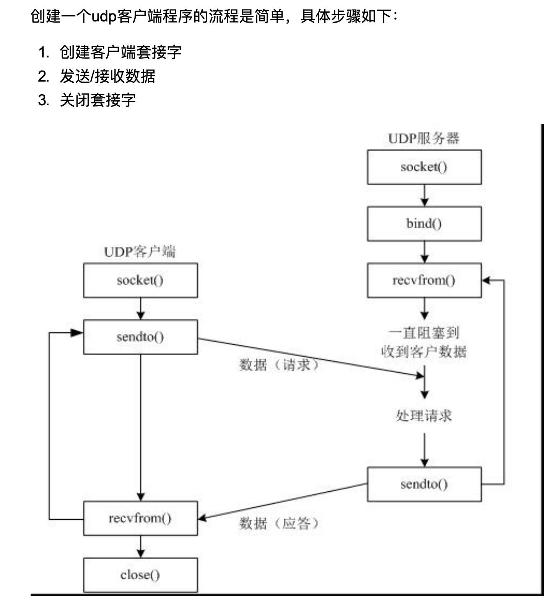
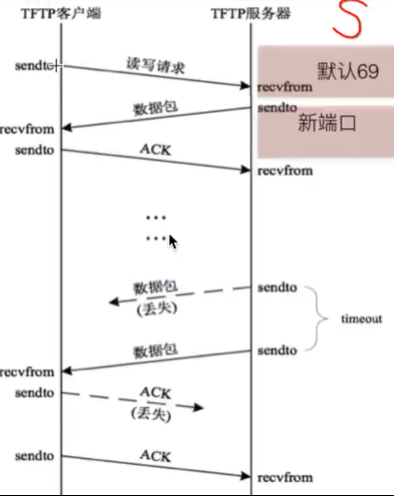
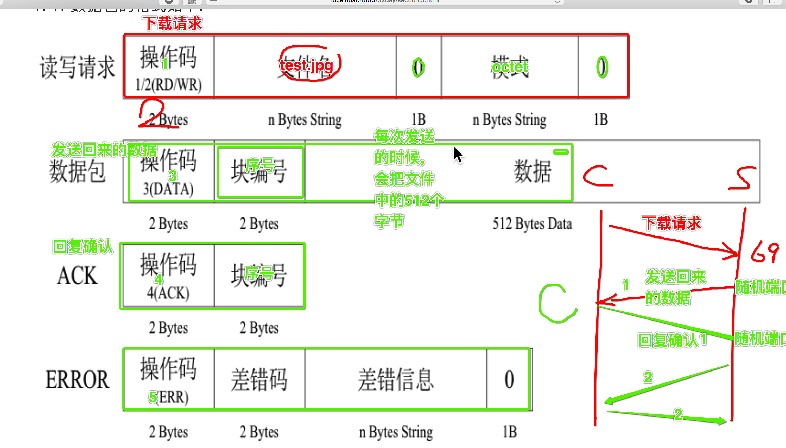
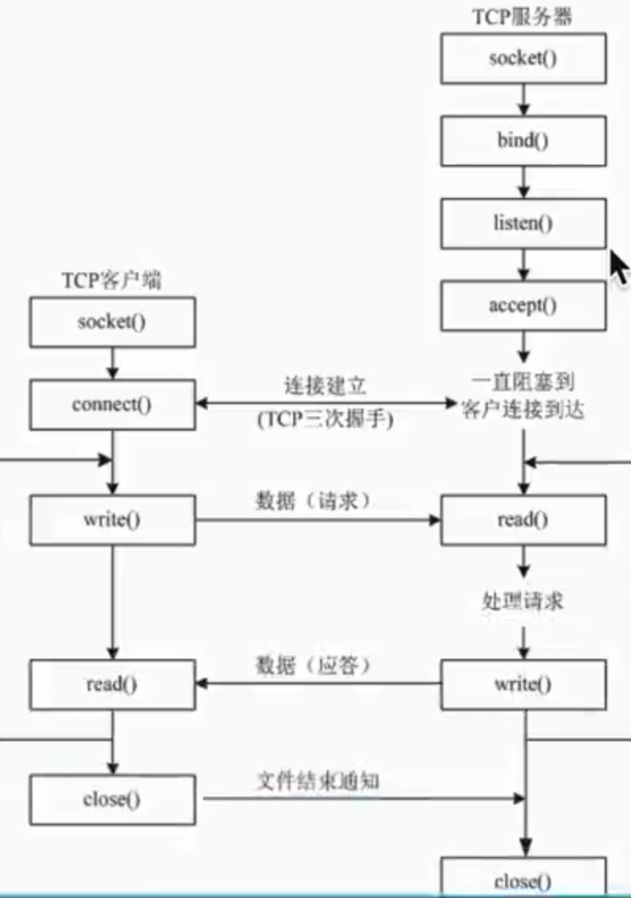
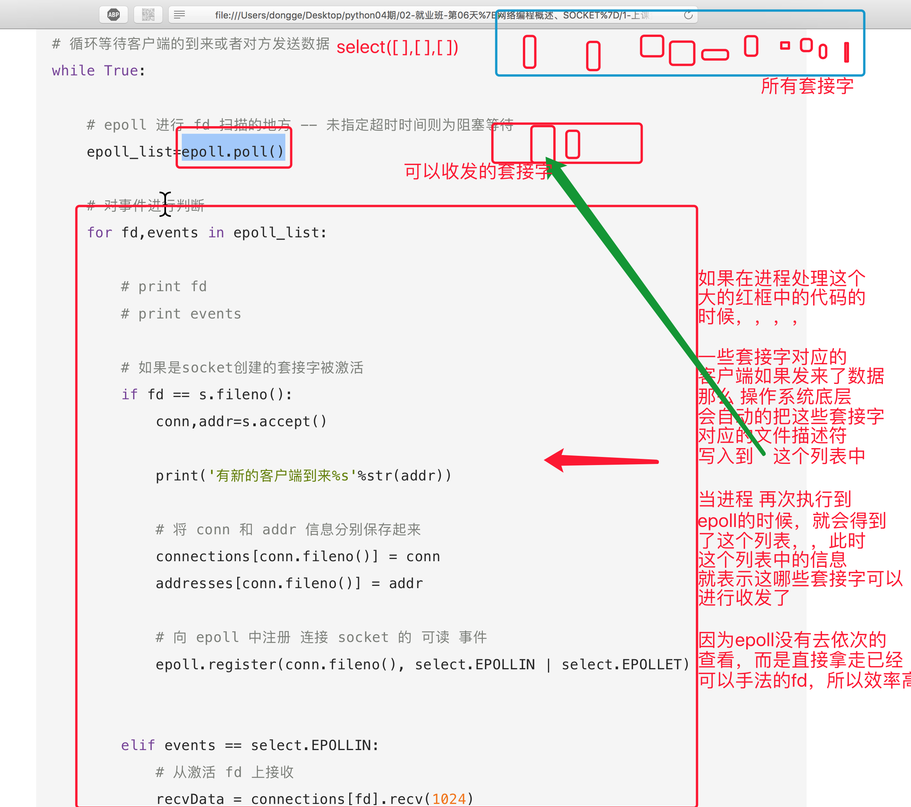
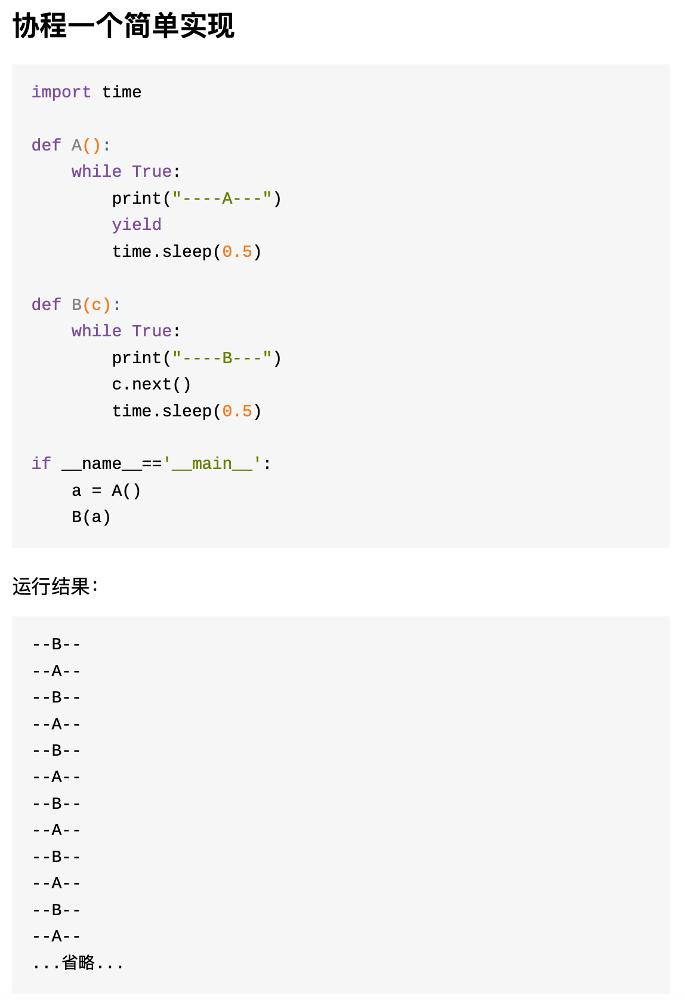

# Python Network Programming

## 1. Basic Knowledges

### a. TCP/IP protocol group:
Application Layer: HTTP, SSL, FTP, SMTP ...
Transport Layer: TCP, UDP
Network Layer: IP, ICMP, IGMP, ARP, RARP
Link Layer

### b. Port
If a host is like a hotel, then the port is like door of a room.
Port 0-1023 is reserved for system services
Port 1024 - 65535 can be used for any program.

### c. IP Address
IP address is the location of a host.
127.0.0.1 is localhost, used for testing the network configuration on a host.

### d. 通讯术语
+ 单工 -- 只有一个人能说话，另一个人听着
+ 半双工 -- 同一时间只能有一个人说
+ 全双工 -- 相当于电话

网络是双全工的.

## 2. Socket

Sockets allow communication between two different processes on the same or different machines. To be more precise, it's a way to talk to other computers using standard Unix file descriptors. In Unix, every I/O action is done by writing or reading a file descriptor. A file descriptor is just an integer associated with an open file and it can be a network connection, a text file, a terminal, or something else.

To a programmer, a socket looks and behaves much like a low-level file descriptor. 

## 3. UDP Programming



### a. Create UDP client
```python
from socket import *
#1. Create UDP socket
udpSocket = socket(AF_INET, SOCK_DGRAM)

#2. Prepare for send address
sendAddr = ("192.168.1.5", 8085)

#3. Prepare for send data
sendData = "Hello, my name is Henry"

#4. Send to the accepter:
udpSocket.sendto(sendData.encode("utf-8"), sendAddr) # sendto(bytes, address)

#5. Close socket
udpSocket.close()
```

### b. Create UDP receiver
```python
from socket import *
#1. Crete UDP socket
udpSocket = socket(AF_INET, SOCK_DGRAM)

#2. Bind IP and port to socket
#If not binding a port, system will give the program a random avaialable port.
bindAddr = ("", 8080)
udpSocket.bind(bindAddr)

#3. Call recvfrom() to receive message
while True:
    recvData, sourceInfo = udpSocket.recvfrom(1024) #every time receives 1024 bytes.
    print(reData.decode("utf-8"))

#4. Close socket
udpSocket.close()
```

## 4. TFTP Protocol
Used for downloading and uploading small files from/to a remote host.
TFTP server by default listens on port 69. When TFTP receives a request, it will use a new temporary port to transfer data.





The communications are using udp protocol.

### How to know if downloading is finished?
If the length of data packet is less than 516B, then the download process gets finished.

### Impletment a TFTP client
```python
import struct
from socket import *
import time
import os

def main():
    #0. 获取要下载的文件名字:
    downloadFileName = raw_input("请输入要下载的文件名:") 

    #1.创建socket
    udpSocket = socket(AF_INET, SOCK_DGRAM)

    requestFileData = struct.pack("!H%dsb5sb"%len(downloadFileName), 1, downloadFileName, 0, "octet", 0) #H 代表操作码大端

    #2. 发送下载文件的请求
    udpSocket.sendto(requestFileData, ("192.168.119.215", 69))

    flag = True #表示能够下载数据，即不擅长，如果是false那么就删除
    num = 0
    f = open(downloadFileName, "w")

    while True:
        #3. 接收服务发送回来的应答数据
        responseData = udpSocket.recvfrom(1024)

        # print(responseData)
        recvData, serverInfo = responseData

        opNum = struct.unpack("!H", recvData[:2])

        packetNum = struct.unpack("!H", recvData[2:4])

        print(packetNum[0])

        # print("opNum=%d"%opNum)
        # print(opNum)

        # if 如果服务器发送过来的是文件的内容的话:
        if opNum[0] == 3: #因为opNum此时是一个元组(3,)，所以需要使用下标来提取某个数据
            
            #计算出这次应该接收到的文件的序号值，应该是上一次接收到的值的基础上+1
            num = num + 1

            # 如果一个下载的文件特别大，即接收到的数据包编号超过了2个字节的大小
            # 那么会从0继续开始，所以这里需要判断，如果超过了65535 那么就改为0
            if num==65536:
                num = 0

            # 判断这次接收到的数据的包编号是否是 上一次的包编号的下一个
            # 如果是才会写入到文件中，否则不能写入（因为会重复）
            if num == packetNum[0]:
                # 把收到的数据写入到文件中
                f.write(recvData[4:])
                num = packetNum[0]

            #整理ACK的数据包
            ackData = struct.pack("!HH", 4, packetNum[0])
            udpSocket.sendto(ackData, serverInfo)

        elif opNum[0] == 5:
            print("sorry，没有这个文件....")
            flag = False

        # time.sleep(0.1)

        if len(recvData)<516:
            break

    if flag == True:
        f.close()
    else:
        os.unlink(downloadFileName)#如果没有要下载的文件，那么就需要把刚刚创建的文件进行删除

if __name__ == '__main__':
    main()
```

## 5. UDP Broadcast
A host sends broadcast packet to switch and switch sends the packets to every nodes.

```python
import socket, sys

# 1. prepare fro broadcast address. <broadcast> equals 192.168.1.255
# host 在比对 IP 地址时采用位与的方法
dest = ('<broadcast>', 7788)

# 2. Create broadcast socket
s = socket.socket(socket.AF_INET, socket.SOCK_DGRAM)
#If socket s needs to send broadcast data, then it needs following line:"
s.setsockopt(socket.SOL_SOCKET, socket.SO_BROADCAST, 1)

# 3. send data to all hosts in current subnet
s.sendto("Hi", dest)

# 4. Wait for response
print("Waiting for response.... (Press Ctrl+C to exit)")
while True:
    (buf, address) = s.recvfrom(2048)
    print("Received from %s: %s" %(address, buf))
```

## 6. TCP Programming


### a. TCP Server:
```python
from socket import *

#1. Create a TCP socket
serverSocket = socket(AF_INET, SOCK_STREAM)

#2. bind IP and port
bindAddr = ("", 8899)
serverSocket.bind(bindAddr)

#3. listen 使 socket 变为可以被动连接
serverSocket.listen(100) #100 is the maxium connection number

#4. Set the listening socket to be unblocked mode
serSocket.setblocking(False)

# 用来保存所有已经连接的客户端的信息
clientAddrList = []

while True:
    #5. accept() waiting for being connected
    clientSocket, clientAddr = serverSocket.accept()
    #clientSocket 表示新的客户端
    #clientAddr 表示这个新的客户端的 ip 以及 port

    clientSocket.setblocking(False)
    clientAddrList.append((clientSocket,clientAddr))

    #6. Receive data
    for clientSocket,clientAddr in clientAddrList:
        try:
            recvData = clientSocket.recv(1024)
        except:
            pass
        else:
            if len(recvData)>0:
                print("%s:%s"%(str(clientAddr), recvData))
                # send response
                clientSocket.send("hahaha".encode("utf-8"))
            else:
                #if the lenght of receive data equals 0, that means the client has closed the connection.
                clientSocket.close()
                clientAddrList.remove((clientSocket, clientAddr))
                print("%s 已经下线"%str(clientAddr))

#7. Close server socket
serverSocket.close()
```

### b. TCP Client:
```python
from socket import *

#1. create socket
clientSocket = socket(AF_INET, SOCK_STREAM)

#2. connect to server
connAddr = ("192.168.1.5", 8899)
clientSocket.connect(connAddr)

#3. send message
#Note: tcp client has already connected with server, so it deosn't need to specify ip address.
clientSocket.send("haha".encode("utf-8"))

#4. print response
recvData = clientSocket.recv(1024)
print("recvData: %s" %(recvData.decode("utf-8")))

clientSocket.close()
```

## 7. Concurrent Server

### a. Single Process Server -- unblock mode
Refer to TCP Server example.


### b. Multi-Process Server
缺点: 当客户端不是特别多的时候，这种方式还行，如果有几百上千个，就不 可取了，因为每次创建进程等过程需要好较大的资源

### c. Multi-Thread Server
```python
from socket import *
from threading import Thread
from time import sleep

# Handle with client request
def dealWithClient(clientSocket, clientAddr):
    while True:
        recvData = clientSocket.recv(1024)
        if len(recvData) > 0:
            print("recv[%s]:%s" %(str(clientAddr), recvData.decode("utf-8")))
        else:
            print("[%s] client has been closed." %str(clientAddr))
    
    clientSocket.close()

def main():
    # 1. create server socket
    serverSocket = socket(AF_INET, SOCK_STREAM)
    # 2. bind listen port
    localAddr = ('', 7788)
    serverSocket.bind(localAddr)
    # 3. Make socket to listen on port
    serverSocket.listen(5)

    try:
        while True:
            #4. Waiting for connection request from client.
            clientSocket, clientAddr = serverSocket.accept()
            #5. Create a thread handling client request
            client = Thread(target=dealWithClient, args=(clientSocket, clientAddr))
            client.start()

            #因为线程中共享这个套接字，如果关闭了会导致这个套接字不可用，程序抛出异常.
            #但是此时在线程中这个套接字可能还在收数据，因此不能关闭
            #newSocket.close()

    except Exception as e:
        raise e
    finally:
        serverSocket.close()
        pass
```

### d. 单进程服务器 - epoll 版
**和 select 版对比的优点:**
1. 没有最大并发连接的限制，能打开的FD(指的是文件描述符，通俗的理解 就是套接字对应的数字编号)的上限远大于1024.
2. 效率提升，不是轮询的方式，不会随着FD数目的增加效率下降。只有活 跃可用的FD才会调用callback函数;即epoll最大的优点就在于它只管 你“活跃”的连接，而跟连接总数无关，因此在实际的网络环境中，epoll 的效率就会远远高于select和poll.



#### Example:
```python
import socket
import select

# 1. create server socket
s = socket.socket(socket.AF_INET, socket.SOCK_STREAM)

# 2. 设置可以重复使用绑定的信息, 避免tcp连接断开并再次连接时出现error EADDRINUSE
s.setsockopt(socket.SOL_SOCKET,socket.SO_REUSEADDR,1)

# 3. bind listen port
s.bind(('', 7788))

# 4. 变为被动
s.listen(10)

# 5. create an epoll object and register socket to epoll
epoll = select.epoll()
#select.EPOLLIN and select.EPOLLET are monitoring event
epoll.register(s.fileno(), select.EPOLLIN, select.EPOLLET)
```

### e. Coroutine 协程
#### What is coroutine?
在一个线程中的某个函数，可以在任何地方保存当前函数的一 些临时变量等信息，然后切换到另外一个函数中执行，注意不是通过调用函 数的方式做到的，并且切换的次数以及什么时候再切换到原来的函数都由开发者自己确定.

#### Differnece with thread?
那么这个过程看起来比线程差不多。其实不然, 线程切换从系统层面远不止保 存和恢复 CPU上下文这么简单。 操作系统为了程序运行的高效性每个线程 都有自己缓存Cache等等数据，操作系统还会帮你做这些数据的恢复操作。 所以线程的切换非常耗性能。但是协程的切换只是单纯的操作CPU的上下 文，所以一秒钟切换个上百万次系统都抗的住。

#### When to use coroutine?
在IO密集型的程序中由于IO操作远远慢于CPU的操作，所以往往需要CPU去 等IO操作。 同步IO下系统需要切换线程，让操作系统可以在IO过程中执行其 他的东⻄。 这样虽然代码是符合人类的思维习惯但是由于大量的线程切换带 来了大量的性能的浪费，尤其是IO密集型的程序。

所以人们发明了异步IO。就是当数据到达的时候触发我的回调。来减少线程 切换带来性能损失。 但是这样的坏处也是很大的，主要的坏处就是操作被 “分片” 了，代码写的不是 “一气呵成” 这种。 而是每次来段数据就要判断 数 据够不够处理哇，够处理就处理吧，不够处理就在等等吧。这样代码的可读 性很低，其实也不符合人类的习惯。

但是协程可以很好解决这个问题。比如 把一个IO操作 写成一个协程。当触发 IO操作的时候就自动让出CPU给其他协程。要知道协程的切换很轻的。 协程 通过这种对异步IO的封装 既保留了性能也保证了代码的容易编写和可读性。 在高IO密集型的程序下很好。但是高CPU密集型的程序下没啥好处。

#### Principal -- Generator


### f. 协程 gevent 版 -- tornado 的核心

#### Principal:
当遇到IO操作时(由于IO操作非常耗时，经常使程序处于等待状态)，比如访问网络，就自动切换到其他的函数，等到IO操 作完成，再在适当的时候切换回来继续执行。

#### Example: `pip install gevent`
```python
import sys
import time
import gevent

from gevent import socket, monkey
monkey.patch_all() #其实是修改了 python 底层代码

def handle_request(clientSocket):
    while True:
        data = clientSocket.recv(1024)
        if not data:
            clientSocket.close()
            break
        print("recv:", data)
        clientSocket.send(data)

def server(port):
    s = socket.socket()
    s.bind(('', port))
    s.listen(5)
    while True:
        clientSocket, clientAddr = s.accept()
        gevent.spawn(handle_request, clientSocket)

if __name__ == '__main__':
    server(7788)
```

